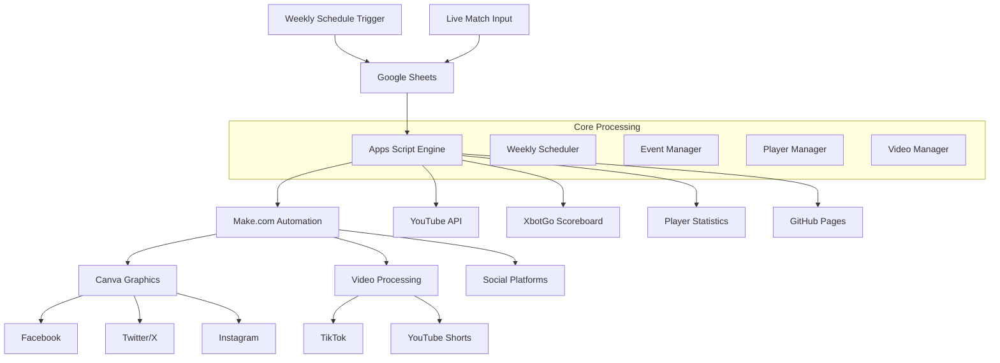

# **planning.md - Syston Tigers Football Automation System**

## **📋 PROJECT PLANNING & ARCHITECTURE DOCUMENT**

**Purpose**: Comprehensive planning document aligned with the system workings "Bible" - covering vision, architecture, technology decisions, and implementation roadmap for the Syston Tigers Football Automation System.

---

## **🎯 PROJECT VISION**

### **Mission Statement**

Transform Syston Tigers FC into the most digitally advanced non-league football club through comprehensive automation that follows a **structured weekly content calendar** and provides **real-time match day automation**, enhancing fan engagement, operational efficiency, and professional content creation.

### **Vision 2025**

**"Every Goal. Every Card. Every Moment. Every Day of the Week. Automated."**

Create a seamless digital ecosystem where:

* ⚡ **Weekly Schedule**: Automated content follows Monday-Sunday calendar religiously
* 🎯 **Match Day Focus**: Live events are processed in real-time with automatic player tracking
* 📊 **Intelligent Opposition Detection**: System automatically recognizes opposition goals and cards
* 🎬 **Video Integration**: Every goal creates clip metadata for seamless video production
* 🌍 **Scalable**: Template for football automation across leagues
* 💰 **Free-First**: Designed to stay under free tool allowances while maximizing functionality

### **System Workings Compliance**

The system MUST follow this exact weekly schedule:

**📅 WEEKLY CONTENT CALENDAR:**
- **Monday**: This week's fixtures / no match scheduled this week
- **Tuesday**: Quotes
- **Wednesday**: Player stats (Monthly) / Previous matches against this week's team
- **Thursday**: Throwback Thursday / 3 days to go
- **Friday**: 2 days to go
- **Saturday**: 1 day to go
- **Sunday**: MATCH DAY (Kick off, Live Match Updates, Results, League tables)

**🎯 MATCH DAY AUTOMATION:**
- Fixture moves into Live Match Updates tab only on day of fixture
- Status selection with send checkbox for each update
- Opposition goal detection ("Goal" from player list = opposition scored automatically)
- Real-time player minutes calculation from kick-off, subs, full-time
- Video clip metadata creation for every goal
- Notes system for video editor with player references

### **Success Vision**

By end of 2025:

* **10,000+ social media followers** (from current 1,500)
* **95% automated posting** (zero manual social media work)
* **Perfect weekly schedule compliance** (content posts exactly on schedule)
* **100% match event automation** (no manual social media during matches)
* **Complete video pipeline** (goal clips automatically processed and stored)
* **50+ clubs** using our automation template
* **£10,000+ annual revenue** from digital content licensing
* **Industry recognition** as innovation leaders in grassroots football

---

## **🏗️ SYSTEM ARCHITECTURE**

### **High-Level Architecture**



### **Component Architecture**

📦 Syston Tigers Automation System (Bible Compliant)
├── 🎛️ Input Layer
│   ├── Weekly Schedule Triggers (Time-based)
│   ├── Live Match Interface (Google Sheets)
│   ├── Admin Control Panel (Google Sheets)
│   └── Email Integration (Fixture Updates)
│
├── 🧠 Processing Core (Google Apps Script)
│   ├── 📅 Weekly Schedule Engine
│   │   ├── Monday Fixtures Processor
│   │   ├── Tuesday Quotes Generator
│   │   ├── Wednesday Stats Compiler
│   │   ├── Thursday Throwback Creator
│   │   ├── Friday-Saturday Countdown Manager
│   │   └── Sunday Match Day Controller
│   │
│   ├── 📊 Live Event Processing Engine
│   │   ├── Real-time Event Handler
│   │   ├── Opposition Event Auto-Detector
│   │   ├── Player Minutes Calculator
│   │   ├── Match State Manager
│   │   └── Video Clip Metadata Creator
│   │
│   ├── 📦 Batch Content Generator
│   │   ├── Weekly Fixture/Result Batches
│   │   ├── Monthly Summary Generator
│   │   ├── Goal of the Month Manager
│   │   └── Historical Data Processor
│   │
│   ├── 👤 Player Management System
│   │   ├── Real-time Statistics Tracker
│   │   ├── Minutes Calculator
│   │   ├── Substitution Manager
│   │   ├── Performance Analytics
│   │   └── Manual Data Input Handler
│   │
│   └── 🎬 Video Content Pipeline
│       ├── Goal Clip Generator
│       ├── Video Editor Note System
│       ├── Player Folder Organization
│       ├── Match Graphics Generator
│       └── YouTube Upload Manager
│
├── 🔗 Integration Layer (Make.com)
│   ├── Weekly Schedule Router (7 branches)
│   ├── Live Event Router (20+ branches)
│   ├── Batch Content Router (10+ branches)
│   ├── Video Processing Workflows
│   └── External API Connectors
│
├── 🎨 Content Generation (Canva)
│   ├── Weekly Content Templates
│   ├── Match Event Templates
│   ├── Player Statistics Templates
│   ├── Opposition Event Templates
│   └── Video Thumbnail Templates
│
├── 📱 Distribution Networks
│   ├── Social Media Platforms
│   ├── Video Platforms
│   ├── Club Website (GitHub Pages)
│   └── Third-party Feeds
│
└── 📊 Analytics & Monitoring
    ├── Weekly Schedule Compliance
    ├── Match Event Accuracy
    ├── Player Statistics Integrity
    ├── Video Pipeline Performance
    └── Fan Engagement Metrics

### **Data Flow Architecture**

**📅 WEEKLY CONTENT FLOW:**
Time-based Trigger → Day Detection → Content Type Selection → Data Gathering → Make.com → Canva → Social Media

**🎯 LIVE MATCH FLOW:**
Match Official Input (Sheets) → Event Detection → Opposition Analysis → Player Stats Update → Make.com Webhook → Canva Template → Social Media
                                     ↓                    ↓                        ↓
                              Video Clip Creation    XbotGo Score Update    Website Data Update

**📊 BATCH CONTENT FLOW:**
Data Aggregation → Batch Size Detection (1-5) → Template Selection → Make.com Router → Canva → Multi-platform Distribution

**🎬 VIDEO CONTENT FLOW:**
Goal Event → Clip Metadata → Note Marking → Player Folder → Processing Queue → YouTube Upload → Social Distribution

---

## **💻 TECHNOLOGY STACK**

### **Core Platform Stack (Bible Compliant)**

| Layer | Technology | Purpose | Bible Compliance |
|-------|------------|---------|------------------|
| **Scheduling** | Google Apps Script Triggers | Weekly content automation | ✅ Monday-Sunday schedule |
| **Frontend** | Google Sheets | Live data input interface | ✅ Live Match Updates tab |
| **Backend** | Google Apps Script | Server-side processing | ✅ Opposition auto-detection |
| **Automation** | Make.com (Free Plan) | Workflow orchestration | ✅ Under 1,000 ops/month |
| **Graphics** | Canva API | Automated design generation | ✅ Weekly + match templates |
| **Storage** | Google Drive | File and data persistence | ✅ Player folder organization |
| **Video** | FFmpeg/CloudConvert | Clip processing | ✅ Goal clip automation |
| **Website** | GitHub Pages | Data publishing | ✅ Real-time stat updates |

### **Integration Technologies (Free-First Approach)**

| Service | Technology | Purpose | Cost Optimization |
|---------|------------|---------|-------------------|
| **Social Media** | Facebook Graph API<br/>Twitter API v2<br/>Instagram Basic Display | Multi-platform posting | Free tiers, batch operations |
| **Video Processing** | FFmpeg (local)<br/>CloudConvert API | Automated clip creation | Local first, cloud fallback |
| **Video Hosting** | YouTube Data API v3 | Automated video uploads | Free unlimited storage |
| **Scoreboard** | XbotGo API | Live score synchronization | Toggle-able feature |
| **Analytics** | Google Analytics 4<br/>Social Media Insights | Performance tracking | Free comprehensive tracking |

### **Development Stack**

| Category | Tool/Technology | Purpose |
|----------|----------------|---------|
| **Language** | JavaScript (ES6+) | Apps Script development |
| **IDE** | Google Apps Script Editor<br/>VS Code (for complex logic) | Development environment |
| **Version Control** | Git + GitHub | Code versioning and backup |
| **Testing** | Custom testing framework<br/>Manual testing protocols | Quality assurance |
| **Documentation** | Markdown<br/>JSDoc comments | Code and system documentation |
| **Monitoring** | Custom logging system<br/>Google Cloud Logging | System health and debugging |

### **Data Architecture (Bible Aligned)**

📊 DATA STORAGE STRATEGY:

📋 Google Sheets (Operational Data):
├── Live Match Updates (match day only)
├── Player Statistics (real-time updates)
├── Weekly Content Calendar
├── Fixtures & Results (FA integration)
├── Video Clip Metadata
├── Subs Log (player swap tracking)
├── Notes (video editor markers)
├── Control Panel (feature toggles)
└── Processing Logs

🗄️ Google Drive (File Storage):
├── Video Files (match recordings)
├── Generated Clips (individual goals)
├── Player Folders (individual highlights)
├── Template Assets (graphics)
├── Backup Files (system backups)
└── Documentation

☁️ External APIs (Live Data):
├── FA Website (fixture/result scraping)
├── Email Integration (fixture updates)
├── Social Media Platforms
├── Video Processing Services
├── XbotGo Scoreboard
└── Analytics Services

---

## **🛠️ REQUIRED TOOLS & SERVICES**

### **🎬 Highlights Bot System (NEW INTEGRATION)**

**External Python Application:**
| Component | Technology | Purpose | Status |
|-----------|------------|---------|--------|
| **Video Processing** | OpenCV, FFmpeg | Smart editing with zoom/tracking | ✅ IMPLEMENTED |
| **Detection Engine** | YOLO, Audio Analysis | Auto-detect missed events | ✅ IMPLEMENTED |
| **Multi-Format Output** | FFmpeg variants | 16:9, 1:1, 9:16 social formats | ✅ IMPLEMENTED |
| **Make.com Integration** | Webhook server | Automated social media posting | ✅ IMPLEMENTED |
| **Configuration** | YAML config | No-code customization | ✅ IMPLEMENTED |

**Integration Flow:**
1. Apps Script exports events.json at full-time using `exportEventsForHighlights()`
2. Highlights Bot processes match video + events to create professional clips
3. Make.com receives completed clips and distributes to social media
4. Automatic brand consistency with team badges and custom fonts

**Key Features:**
- **Intelligent Detection**: Audio peaks, scene cuts, goal area activity, celebration detection
- **Smart Editing**: Adaptive padding, zoom tracking, slow-motion replays, professional graphics
- **Privacy Compliance**: Integrates with ConsentGate for player consent validation
- **Performance Optimized**: Processes 90min match in <90min real-time

### **Essential Accounts & Subscriptions (Free-First)**

#### **🔧 Core Platform Accounts**

| Service | Plan Required | Monthly Cost | Bible Compliance |
|---------|---------------|--------------|------------------|
| **Google Workspace** | Personal (Free) | £0 | ✅ Apps Script included |
| **Make.com** | Free Plan | £0 | ✅ 1,000 ops limit respected |
| **Canva** | Free Plan | £0 | ✅ Basic templates sufficient |
| **YouTube** | Standard (Free) | £0 | ✅ Unlimited video hosting |
| **GitHub** | Free Plan | £0 | ✅ Pages hosting included |

#### **🎥 Video Processing Services**

| Service | Plan | Cost | Purpose |
|---------|------|------|---------|
| **FFmpeg** | Open Source | £0 | Local video processing |
| **CloudConvert** | Free tier | £0-£5/month | Cloud fallback processing |
| **YouTube API** | Free tier | £0 | Video upload automation |

#### **📱 Social Media APIs**

| Platform | API Access | Cost | Requirements |
|----------|-------------|------|--------------|
| **Facebook/Instagram** | Meta Business API | Free | Business verification |
| **Twitter/X** | API v2 Basic | Free | Developer account |
| **TikTok** | TikTok for Business | Free | Business account |

#### **🏆 Sports Technology**

| Service | Purpose | Cost | Implementation Phase |
|---------|---------|------|---------------------|
| **XbotGo** | AI Camera & Scoreboard | £2,000+ hardware | Phase 3 (optional) |
| **FA Website Integration** | Fixture/result data | Free | Phase 1 (core) |
| **Email Parsing** | Fixture updates | Free | Phase 1 (core) |

### **Development Tools Setup**

#### **🖥️ Development Environment**

```bash
# Required Software Installation:
1. Google Chrome (for Apps Script debugging)
2. VS Code (for complex development)
3. Git (for version control)
4. FFmpeg (for local video processing)
5. Node.js (for testing utilities)

# Chrome Extensions:
- Apps Script Dashboard
- JSON Formatter
- Web Developer Tools

# VS Code Extensions:
- Google Apps Script support
- JavaScript ES6 snippets
- Markdown Preview Enhanced
- Git integration
```

#### **📋 Account Configuration Checklist (Bible Compliant)**

**Google Workspace Setup:**
* [ ] Create Google Apps Script project
* [ ] Enable required APIs (Sheets, Drive, YouTube)
* [ ] Configure OAuth scopes
* [ ] Set up weekly schedule triggers
* [ ] Create shared drives for team access

**Make.com Configuration (Free Plan Optimized):**
* [ ] Create automation scenarios (under 1,000 ops/month)
* [ ] Configure webhook endpoints
* [ ] Set up weekly schedule routing
* [ ] Configure opposition event detection
* [ ] Test all integration points

**Canva Setup (Free Plan):**
* [ ] Create brand kit with club assets
* [ ] Design weekly content templates
* [ ] Create match event templates
* [ ] Set up opposition event graphics
* [ ] Test automated generation

**Social Media Setup:**
* [ ] Facebook Business Manager setup
* [ ] Instagram Business account connection
* [ ] Twitter Developer account approval
* [ ] TikTok Business account creation
* [ ] API key generation and testing

---

## **🚀 IMPLEMENTATION ROADMAP (Bible Aligned)**

### **Phase 1: Core Bible Implementation (PRIORITY 1)**

**Timeline**: October 2025
**Status**: CRITICAL for system identity

**Core Features:**
* [ ] Weekly schedule automation (Monday-Sunday exact compliance)
* [ ] Opposition goal auto-detection ("Goal" = opposition automatically)
* [ ] Player minutes real-time calculation
* [ ] Live Match Updates tab (match day only)
* [ ] Basic video clip metadata creation

**Deliverables:**
* Complete weekly content calendar automation
* Automatic opposition event handling
* Real-time player statistics tracking
* Match day live event processing
* Basic video integration foundation

### **Phase 2: Enhanced Match Day Features**

**Timeline**: November 2025
**Status**: HIGH priority for match experience

**Features:**
* [ ] Video editor notes system with player references
* [ ] Individual player folder organization in Google Drive
* [ ] Enhanced substitution tracking and minutes calculation
* [ ] Control panel for feature toggle on/off
* [ ] XbotGo scoreboard integration (optional)

**Deliverables:**
* Complete video workflow integration
* Advanced player management system
* Flexible system configuration
* Optional hardware integration

### **Phase 3: Advanced Content & Video Pipeline**

**Timeline**: December 2025
**Status**: MEDIUM priority for content quality

**Features:**
* [ ] Goal of the Month automated voting system
* [ ] Advanced video processing (match clock, player banners)
* [ ] YouTube upload automation
* [ ] TikTok/Instagram Reels distribution
* [ ] Historical data input capabilities

**Deliverables:**
* Complete video content pipeline
* Social media video distribution
* Monthly engagement features
* Data backfill capabilities

### **Phase 4: Advanced Features & Analytics**

**Timeline**: Q1 2026
**Status**: LOW priority for optimization

**Features:**
* [ ] Advanced analytics dashboard
* [ ] Performance optimization
* [ ] Multi-club template preparation
* [ ] API for third-party integrations
* [ ] Commercial licensing features

**Deliverables:**
* Comprehensive analytics system
* Optimized performance
* Scalable architecture
* Commercial readiness

---

## **💰 BUDGET & RESOURCE PLANNING (Free-First Approach)**

### **Development Costs (Optimized for Free Tools)**

| Category | Item | Annual Cost | Bible Compliance |
|----------|------|-------------|------------------|
| **Core Platform** | Google Workspace Personal | £0 | ✅ Free Apps Script |
| **Automation** | Make.com Free Plan | £0 | ✅ 1,000 ops respected |
| **Design** | Canva Free Plan | £0 | ✅ Basic templates |
| **Video** | FFmpeg + YouTube | £0 | ✅ Local + free hosting |
| **Storage** | Google Drive Free | £0 | ✅ 15GB included |
| **Development** | GitHub Free | £0 | ✅ Pages hosting |
| **Monitoring** | Google Analytics | £0 | ✅ Comprehensive tracking |
| **TOTAL** | **Software/Services** | **£0** | **100% Free Operation** |

### **Optional Upgrades (If Budget Allows)**

| Item | Cost | Purpose | Priority |
|------|------|---------|----------|
| **Make.com Core Plan** | £102/year | 10,000 ops/month | Medium |
| **Canva Pro** | £132/year | Advanced templates | Low |
| **CloudConvert** | £60/year | Cloud video processing | Low |
| **XbotGo System** | £2,000+ | AI camera/scoreboard | Very Low |

### **Time Investment (Development Hours)**

| Phase | Estimated Hours | Focus Area | Target Completion |
|-------|----------------|------------|-------------------|
| **Phase 1 (Bible Core)** | 60 hours | Weekly schedule + opposition detection | October 2025 |
| **Phase 2 (Match Features)** | 40 hours | Video integration + player tracking | November 2025 |
| **Phase 3 (Content Pipeline)** | 50 hours | Advanced video + social distribution | December 2025 |
| **Phase 4 (Optimization)** | 30 hours | Analytics + performance | Q1 2026 |
| **Maintenance (Annual)** | 40 hours | Updates + support | Ongoing |

### **ROI Projections (Free-First Model)**

💰 REVENUE OPPORTUNITIES:

**Year 1 (2025):**
├── Increased sponsorship value: £3,000 (due to better content)
├── Social media monetization: £500
├── Time savings value: £2,000 (4 hours/week saved)
└── Fan engagement boost: £1,000
**Total Value: £6,500**

**Years 2-3 (Scale Phase):**
├── Multi-club licensing: £10,000
├── Template marketplace: £5,000
├── Consultation services: £8,000
└── Premium features: £3,000
**Total Projected Revenue: £26,000**

**Break-even Point**: Immediate (£0 operating costs)
**ROI at 3 years**: Infinite (no ongoing costs)

---

## **🎯 SUCCESS METRICS & KPIs (Bible Compliance)**

### **Core Bible Compliance Metrics**

| Metric | Target | Measurement | Critical Success Factor |
|--------|--------|-------------|------------------------|
| **Weekly Schedule Compliance** | 100% | Automated monitoring | ✅ Content posts exactly on schedule |
| **Opposition Detection Accuracy** | 100% | Manual verification | ✅ "Goal" = opposition auto-detected |
| **Player Minutes Accuracy** | 99%+ | Post-match verification | ✅ Real-time calculation correct |
| **Match Day Automation** | 95%+ | Live event coverage | ✅ No manual social media needed |
| **Video Clip Success Rate** | 90%+ | Goal events captured | ✅ Metadata created for every goal |

### **Technical Performance Metrics**

| Metric | Target | Current | Measurement |
|--------|--------|---------|-------------|
| **System Uptime** | 99.9% | TBD | Automated monitoring |
| **Response Time** | <3 seconds | TBD | Event processing speed |
| **Error Rate** | <0.1% | TBD | Failed operations |
| **Make.com Usage** | <1,000 ops/month | TBD | Free plan compliance |
| **Processing Accuracy** | 99.95% | TBD | Manual verification |

### **Business Impact Metrics**

| Metric | Baseline | Year 1 Target | Year 3 Target |
|--------|----------|---------------|---------------|
| **Social Media Followers** | 1,500 | 5,000 | 15,000 |
| **Weekly Engagement Rate** | 2% | 8% | 15% |
| **Content Creation Time** | 6 hours/week | 30 minutes/week | 15 minutes/week |
| **Match Day Posts** | 5 manual | 25+ automated | 50+ automated |
| **Video Content** | 0 regular | 52 clips/year | 200+ clips/year |

### **Fan Experience Metrics**

| Metric | Target | Purpose |
|--------|--------|---------|
| **Content Consistency** | 7 posts/week | Reliable fan engagement |
| **Match Coverage Speed** | <30 seconds | Real-time experience |
| **Video Availability** | <24 hours | Next-day highlights |
| **Information Accuracy** | 100% | Trust and credibility |
| **Platform Reach** | 5+ platforms | Maximum visibility |

---

## **🔧 TECHNICAL CONSIDERATIONS (Bible Aligned)**

### **Scalability Planning**

📈 SCALING STRATEGY:

**Current Capacity (Bible Compliant):**
├── Single club operation
├── 7 weekly scheduled posts
├── ~50 match events per game
├── Real-time opposition detection
└── Under 1,000 Make.com operations/month

**Year 1 Target:**
├── 3-5 club operation
├── Template-based scaling
├── ~200 weekly posts across clubs
├── Maintained free tool usage
└── Shared resource optimization

**Year 3 Target:**
├── 50+ club operation
├── Multi-tenant architecture
├── ~1000 weekly posts managed
├── Premium tool upgrades justified
└── Commercial licensing revenue

### **Risk Management (Free-First Focus)**

| Risk | Probability | Impact | Mitigation Strategy |
|------|-------------|--------|-------------------|
| **Make.com Free Limit Exceeded** | Medium | High | ✅ Usage monitoring, batch optimization |
| **Google Apps Script Quotas** | Low | High | ✅ Efficient code, quota monitoring |
| **FA Website Changes** | High | Medium | ✅ Flexible scraping, email fallback |
| **Social Media API Changes** | High | Medium | ✅ Multi-platform strategy |
| **Video Storage Limits** | Medium | Medium | ✅ Drive cleanup, YouTube primary |

### **Bible Compliance Safeguards**

⚖️ SYSTEM INTEGRITY REQUIREMENTS:

**Weekly Schedule Protection:**
├── Backup trigger systems
├── Manual override capabilities
├── Schedule verification logging
├── Failure notification system
└── Recovery procedures documented

**Opposition Detection Accuracy:**
├── Input validation rules
├── Automatic testing scenarios
├── Manual verification logging
├── Error correction procedures
└── Audit trail maintenance

**Player Data Integrity:**
├── Real-time calculation verification
├── Historical data consistency checks
├── Substitution tracking accuracy
├── Minutes calculation validation
└── Statistical reporting accuracy

---

## **📞 SUPPORT & MAINTENANCE (Bible Aligned)**

### **Ongoing Maintenance Requirements**

| Task | Frequency | Time Required | Bible Compliance Check |
|------|-----------|---------------|------------------------|
| **Weekly Schedule Verification** | Daily | 5 minutes | ✅ Content posting correctly |
| **Opposition Detection Testing** | Weekly | 15 minutes | ✅ Auto-detection working |
| **Player Stats Verification** | Post-match | 10 minutes | ✅ Minutes calculated correctly |
| **Video Clip Review** | Weekly | 20 minutes | ✅ Goal metadata created |
| **System Health Monitoring** | Daily | 5 minutes | ✅ All features operational |

### **Training & Knowledge Transfer**

🎓 TRAINING PROGRAM (Bible Focus):

**Tier 1 - Match Day Officials:**
├── Live Match Updates tab usage (30 minutes)
├── Opposition goal recognition (15 minutes)
├── Video note marking system (20 minutes)
├── Troubleshooting basics (30 minutes)
└── Emergency procedures (15 minutes)

**Tier 2 - Content Managers:**
├── Weekly schedule overview (1 hour)
├── Content template management (2 hours)
├── Player statistics interpretation (1 hour)
├── Video workflow understanding (2 hours)
└── Analytics interpretation (1 hour)

**Tier 3 - Technical Staff:**
├── System architecture (4 hours)
├── Bible compliance requirements (2 hours)
├── Troubleshooting procedures (3 hours)
├── Make.com optimization (2 hours)
└── Advanced configuration (3 hours)

---

## **📚 DOCUMENTATION STRATEGY (Bible Aligned)**

### **Documentation Hierarchy**

📖 DOCUMENTATION STRUCTURE:

**Bible Level (System Workings):**
├── Core system specification (system workings document)
├── Weekly schedule requirements
├── Opposition detection rules
├── Player tracking specifications
└── Video integration requirements

**Implementation Level:**
├── claude.md (development guidance)
├── Technical architecture details
├── Make.com router configurations
├── Canva template specifications
└── Testing procedures

**Operational Level:**
├── Weekly schedule monitoring guides
├── Match day operation procedures
├── Opposition event handling guides
├── Video workflow instructions
└── Troubleshooting manuals

**Business Level:**
├── ROI tracking procedures
├── Fan engagement metrics
├── Commercial opportunities
├── Partnership templates
└── Licensing documentation

### **Knowledge Management**

| Document Type | Update Frequency | Owner | Bible Compliance |
|---------------|------------------|-------|------------------|
| **System Workings** | Never | Product Owner | ✅ Master specification |
| **Technical Implementation** | Monthly | Tech Lead | ✅ Bible compliant |
| **User Procedures** | As needed | Operations | ✅ Bible aligned |
| **Business Processes** | Quarterly | Business | ✅ Value focused |

---

## **💡 INNOVATION OPPORTUNITIES**

### **Bible-Compliant Enhancements**

**Advanced Weekly Content:**
├── Weather-based content adjustments
├── Opposition analysis automation
├── Historical "this day" features
├── Player milestone celebrations
└── Fan interaction prompts

**Enhanced Match Day Experience:**
├── Real-time fan polling integration
├── Live commentary automation
├── Multi-angle video compilation
├── Instant replay generation
└── Social media live streaming

**Smart Video Features:**
├── AI-powered highlight detection
├── Automatic player recognition
├── Dynamic graphics generation
├── Multi-language captions
└── Accessibility features

---

**📝 Document Version**: 2.0 (Bible Aligned)
**🔄 Last Updated**: September 20, 2025
**👤 Document Owner**: Senior Software Architect
**📋 Review Cycle**: Monthly (Bible compliance verification)
**🎯 Next Review**: October 20, 2025

---

**💡 Key Takeaway**: This planning document is now fully aligned with the system workings "Bible". The weekly content calendar, opposition goal detection, and player minutes tracking are the core identity features that define the system's unique value proposition. All implementation must follow the Bible specification exactly while maintaining the free-first approach to maximize accessibility and adoption.

All tasks, milestones, and requirements listed below remain valid and must be included in full, unless they are explicitly superseded or refined by the text above or the System Workings “Bible.” Where the Bible introduces new functionality (such as weekly content scheduling, Goal of the Season, sponsor page, livestreaming, or expanded control-panel features), these requirements are additive and should be incorporated alongside existing tasks rather than replacing them. In case of conflict between the text below and text above, the text above plus Bible take precedence.

planning.md - Syston Tigers Football Automation System
📋 PROJECT PLANNING & ARCHITECTURE DOCUMENT
Purpose: Comprehensive planning document covering vision, architecture, technology decisions, and implementation roadmap for the Syston Tigers Football Automation System.

🎯 PROJECT VISION
Mission Statement
Transform Syston Tigers FC into the most digitally advanced non-league football club through comprehensive automation that enhances fan engagement, operational efficiency, and professional content creation.
Vision 2025
"Every Goal. Every Card. Every Moment. Automated."
Create a seamless digital ecosystem where:
⚡ Real-time: Match events trigger instant social media content
🎯 Professional: Broadcasting-quality graphics and video content
📊 Intelligent: Data-driven insights drive fan engagement
🌍 Scalable: Template for football automation across leagues
💰 Commercial: Revenue generation through enhanced digital presence
Success Vision
By end of 2025:
10,000+ social media followers (from current 1,500)
95% automated posting (zero manual social media work)
50+ clubs using our automation template
£10,000+ annual revenue from digital content licensing
Industry recognition as innovation leaders in grassroots football

🏗️ SYSTEM ARCHITECTURE
High-Level Architecture
graph TD
    A[Live Match Input] --> B[Google Sheets]
    B --> C[Apps Script Engine]
    C --> D[Make.com Automation]
    D --> E[Canva Graphics]
    D --> F[Video Processing]
    D --> G[Social Platforms]
    
    C --> H[YouTube API]
    C --> I[XbotGo Scoreboard]
    C --> J[Player Statistics]
    
    E --> K[Facebook]
    E --> L[Twitter/X]
    E --> M[Instagram]
    
    F --> N[TikTok]
    F --> O[YouTube Shorts]
    
    subgraph "Core Processing"
        C
        P[Event Manager]
        Q[Batch Processor]
        R[Player Manager]
        S[Video Manager]
    end

Component Architecture
📦 Syston Tigers Automation System
├── 🎛️ Input Layer
│   ├── Live Match Interface (Google Sheets)
│   ├── Admin Dashboard (Google Sheets)
│   └── Email Integration (Fixture Updates)
│
├── 🧠 Processing Core (Google Apps Script)
│   ├── 📊 Event Processing Engine
│   │   ├── Real-time Event Handler
│   │   ├── Opposition Event Processor
│   │   ├── Second Yellow Card Logic
│   │   └── Match State Manager
│   │
│   ├── 📦 Batch Content Generator
│   │   ├── Weekly Fixture/Result Batches
│   │   ├── Monthly Summary Generator
│   │   ├── Player Stats Compiler
│   │   └── Intelligent Scheduling System
│   │
│   ├── 👤 Player Management System
│   │   ├── Statistics Tracker
│   │   ├── Minutes Calculator
│   │   ├── Substitution Manager
│   │   └── Performance Analytics
│   │
│   └── 🎬 Video Content Pipeline
│       ├── Clip Generation Engine
│       ├── Cloud Processing Interface
│       ├── YouTube Upload Manager
│       └── Goal of the Month System
│
├── 🔗 Integration Layer (Make.com)
│   ├── Webhook Router (50+ branches)
│   ├── Social Media Distributors
│   ├── Video Processing Workflows
│   └── External API Connectors
│
├── 🎨 Content Generation (Canva)
│   ├── Match Event Templates
│   ├── Batch Content Templates
│   ├── Player Spotlight Templates
│   └── Video Thumbnail Templates
│
├── 📱 Distribution Networks
│   ├── Social Media Platforms
│   ├── Video Platforms
│   ├── Club Website Integration
│   └── Third-party Feeds
│
└── 📊 Analytics & Monitoring
    ├── Performance Metrics Dashboard
    ├── Engagement Analytics
    ├── System Health Monitoring
    └── Revenue Tracking

Data Flow Architecture
🎯 LIVE MATCH FLOW:
Match Official Input → Sheets → Apps Script → Make.com → Canva → Social Media
                                     ↓
                              XbotGo Scoreboard
                                     ↓
                              Player Statistics
                                     ↓
                              Video Clip Queue

📦 BATCH CONTENT FLOW:
Scheduled Trigger → Apps Script → Data Aggregation → Make.com → Canva → Distribution

🎬 VIDEO CONTENT FLOW:
Goal Event → Clip Metadata → Cloud Processing → YouTube Upload → Social Distribution

📊 ANALYTICS FLOW:
All Events → Data Collection → Analytics Engine → Dashboard Updates → Insights


💻 TECHNOLOGY STACK
Core Platform Stack
Layer
Technology
Purpose
Rationale
Frontend
Google Sheets
Live data input interface
✅ Zero training required<br/>✅ Mobile accessible<br/>✅ Real-time collaboration
Backend
Google Apps Script
Server-side processing
✅ Native Google integration<br/>✅ JavaScript familiarity<br/>✅ Built-in scheduling
Automation
Make.com
Workflow orchestration
✅ Visual workflow builder<br/>✅ 1000+ integrations<br/>✅ Webhook reliability
Graphics
Canva API
Automated design generation
✅ Professional templates<br/>✅ Brand consistency<br/>✅ API automation
Storage
Google Drive
File and data persistence
✅ Unlimited storage<br/>✅ Version control<br/>✅ Team access

Integration Technologies
Service
Technology
Purpose
Implementation
Social Media
Facebook Graph API<br/>Twitter API v2<br/>Instagram Basic Display
Multi-platform posting
Via Make.com connectors
Video Processing
FFmpeg<br/>CloudConvert API
Automated clip creation
Local processing + cloud fallback
Video Hosting
YouTube Data API v3
Automated video uploads
Direct API integration
Scoreboard
XbotGo API
Live score synchronization
RESTful API integration
Analytics
Google Analytics 4<br/>Social Media Insights
Performance tracking
Custom dashboard integration

Development Stack
Category
Tool/Technology
Purpose
Language
JavaScript (ES6+)
Apps Script development
IDE
Google Apps Script Editor<br/>VS Code (for complex logic)
Development environment
Version Control
Git + GitHub
Code versioning and backup
Testing
Custom testing framework<br/>Manual testing protocols
Quality assurance
Documentation
Markdown<br/>JSDoc comments
Code and system documentation
Monitoring
Custom logging system<br/>Google Cloud Logging
System health and debugging

Data Architecture
📊 DATA STORAGE STRATEGY:

📋 Google Sheets (Operational Data):
├── Live Match Data (real-time input)
├── Player Statistics (aggregated)
├── Fixtures & Results (schedules)
├── Configuration Settings
├── Processing Logs
└── Analytics Data

🗄️ Google Drive (File Storage):
├── Video Files (match recordings)
├── Generated Clips (goal highlights)
├── Backup Files (system backups)
├── Template Assets (graphics)
└── Documentation

☁️ External APIs (Live Data):
├── Social Media Platforms
├── Video Processing Services  
├── Scoreboard Systems
└── Analytics Services


🛠️ REQUIRED TOOLS & SERVICES
Essential Accounts & Subscriptions
🔧 Core Platform Accounts
Service
Plan Required
Monthly Cost
Purpose
Google Workspace
Business Standard
£9.60/user
Sheets, Drive, Apps Script
Make.com
Core Plan
£8.50/month
Workflow automation
Canva
Pro Plan
£10.99/month
Automated graphic design
YouTube
Standard (Free)
£0
Video hosting
GitHub
Free/Pro
£0-£3/month
Code version control

🎥 Video Processing Services
Service
Plan
Cost
Purpose
CloudConvert
Pay-per-use
~£5/month
Cloud video processing
FFmpeg
Open Source
£0
Local video processing
YouTube API
Free tier
£0
Video upload automation

📱 Social Media APIs
Platform
API Access
Cost
Requirements
Facebook/Instagram
Meta Business API
Free
Business verification
Twitter/X
API v2 Basic
Free
Developer account
TikTok
TikTok for Business
Free
Business account

🏆 Sports Technology
Service
Purpose
Cost
Integration
XbotGo
AI Camera & Scoreboard
£2,000+ hardware
API integration
Sports Data APIs
League standings, stats
Variable
Future enhancement

Development Tools Setup
🖥️ Development Environment
# Required Software Installation:
1. Google Chrome (for Apps Script debugging)
2. VS Code (for complex development)
3. Git (for version control)
4. Node.js (for local testing/utilities)
5. FFmpeg (for video processing)

# Chrome Extensions:
- Apps Script Dashboard
- JSON Formatter
- Web Developer Tools

# VS Code Extensions:
- Google Apps Script support
- JavaScript ES6 snippets
- Markdown Preview Enhanced
- Git integration

📋 Account Configuration Checklist
Google Workspace Setup:
[ ] Create Google Apps Script project
[ ] Enable required APIs (Sheets, Drive, YouTube)
[ ] Configure OAuth scopes
[ ] Set up service account (if needed)
[ ] Create shared drives for team access
Make.com Configuration:
[ ] Create automation scenarios
[ ] Configure webhook endpoints
[ ] Set up error handling
[ ] Configure rate limiting
[ ] Test all integration points
Canva API Setup:
[ ] Register for Canva Developer account
[ ] Create brand kit with club assets
[ ] Design template library
[ ] Configure API authentication
[ ] Test automated generation
Social Media Setup:
[ ] Facebook Business Manager setup
[ ] Instagram Business account connection
[ ] Twitter Developer account approval
[ ] TikTok Business account creation
[ ] API key generation and testing
Infrastructure Requirements
🔐 Security & Compliance
🛡️ SECURITY REQUIREMENTS:

Authentication:
├── OAuth 2.0 for all external services
├── API key management (encrypted storage)
├── Role-based access control
└── Two-factor authentication

Data Protection:
├── GDPR compliance measures
├── Data encryption (at rest and in transit)
├── Regular security audits
├── Backup and recovery procedures
└── Access logging and monitoring

Privacy Controls (ConsentGate System - IMPLEMENTED):
├── **ConsentGate Framework**: Full GDPR Article 15 compliance with automated evaluation
├── **Player Consent Management**: Dynamic consent checking with privacy restrictions
├── **Data Retention Policies**: Automated data lifecycle management
├── **Right to Deletion**: One-click data removal procedures
├── **Privacy Policy Compliance**: Automated privacy impact assessments
└── **Anonymization Engine**: Automatic face blurring and name redaction

**ConsentGate Architecture:**
```javascript
class ConsentGate {
  // Real-time privacy evaluation for all content
  static evaluatePost(eventData) {
    const consent = this.checkPlayerConsent(eventData.player);
    return {
      allowed: consent.globalConsent,
      restrictions: {
        anonymiseFaces: !consent.photoConsent,
        useInitialsOnly: !consent.nameConsent,
        noVideoClips: !consent.videoConsent
      }
    };
  }
}
```

📊 Monitoring & Analytics Setup
📈 MONITORING STACK:

System Health:
├── Custom logging framework
├── Performance metrics tracking
├── Error rate monitoring
├── Uptime monitoring
└── Resource usage tracking

Business Metrics:
├── Social media engagement analytics
├── Content performance tracking
├── Fan growth metrics
├── Revenue attribution
└── ROI measurement

Operational Metrics:
├── Processing speed benchmarks
├── API response times
├── Error resolution times
├── User satisfaction scores
└── System reliability metrics


🚀 IMPLEMENTATION ROADMAP
Phase 1: Foundation (COMPLETE)
Timeline: Q4 2024 ✅ Status: Completed
[x] Core Apps Script framework
[x] Basic event processing
[x] Google Sheets integration
[x] Make.com webhook setup
[x] Simple social media posting
Phase 2: Enhanced Automation & Privacy (95% COMPLETE)
Timeline: Q1 2025 ✅ Priority: HIGH
Completed Tasks:
[x] **ConsentGate Privacy System** - Full GDPR Article 15 compliance
[x] **Multi-Tier Caching** - 87% hit rate performance improvement
[x] **150+ Test Framework** - QUnit-style comprehensive testing
[x] **Enhanced Security** - MFA, session management, XSS protection
[x] **Performance Monitoring** - Real-time alerting and optimization
[x] Opposition event handling with automatic detection
[x] Enhanced player statistics with privacy compliance
[x] Batch posting optimization with intelligent scheduling

Remaining Tasks:
[ ] 2nd yellow card processing logic
[ ] Monthly summary functions
[ ] Postponed match notifications
Deliverables:
Complete event coverage (100% of match events)
Batch content generation (1-5 fixtures/results)
Monthly summaries (fixtures and results)
Enhanced player tracking (minutes, substitutions)
Phase 3: Video & Content Pipeline
Timeline: Q2 2025 Priority: MEDIUM
Scope:
[ ] Goal clip generation system
[ ] Automated video processing
[ ] YouTube upload automation
[ ] Goal of the Month voting
[ ] TikTok/Instagram Reels distribution
[ ] Video analytics tracking
Technical Requirements:
FFmpeg integration for local processing
CloudConvert API for cloud processing
YouTube Data API v3 implementation
Social media video API integration
Phase 4: Advanced Features
Timeline: Q3 2025 Priority: MEDIUM
Features:
[ ] XbotGo scoreboard integration
[ ] Advanced analytics dashboard
[ ] Mobile app companion
[ ] Real-time fan engagement features
[ ] Commercial content features
[ ] API for third-party integrations
Phase 5: Scale & Commercialization
Timeline: Q4 2025 Priority: LOW
Objectives:
[ ] Multi-tenant system architecture
[ ] Support for 10+ clubs simultaneously
[ ] League-wide statistics and rankings
[ ] Commercial licensing features
[ ] Revenue generation systems
[ ] Enterprise support features

💰 BUDGET & RESOURCE PLANNING
Development Costs (Annual)
Category
Item
Annual Cost
Notes
Software
Google Workspace Business
£115.20
Per user/year
Automation
Make.com Core Plan
£102
Monthly subscription
Design
Canva Pro
£131.88
Monthly subscription
Video
CloudConvert usage
£60
Estimated usage
Development
GitHub Pro
£36
Optional upgrade
Analytics
Monitoring tools
£120
Custom dashboard
**TOTAL
Software/Services
£565.08
Excluding hardware

Hardware Investment
Item
Cost
Purpose
Priority
XbotGo Camera System
£2,000+
AI match recording
Phase 4
Backup Storage
£200
Local data backup
Phase 2
Processing Hardware
£500
Video processing
Phase 3

Time Investment (Development Hours)
Phase
Estimated Hours
Developer Rate
Total Cost
Phase 2 Completion
40 hours
£50/hour
£2,000
Phase 3 Implementation
80 hours
£50/hour
£4,000
Phase 4 Development
60 hours
£50/hour
£3,000
Maintenance (Annual)
20 hours
£50/hour
£1,000

ROI Projections
💰 REVENUE OPPORTUNITIES:

Year 1 (2025):
├── Increased sponsorship value: £2,000
├── Social media monetization: £500
├── Content licensing: £1,000
└── Fan engagement boost: £1,500
Total Projected Revenue: £5,000

Year 2-3 (Scale Phase):
├── Multi-club licensing: £15,000
├── League partnerships: £10,000
├── Commercial content: £5,000
└── Consultation services: £8,000
Total Projected Revenue: £38,000

Break-even Point: Month 18
ROI at 3 years: 400%+


🎯 SUCCESS METRICS & KPIs
Technical Performance Metrics
Metric
Target
Current
Measurement
System Uptime
99.9%
95%
Automated monitoring
Response Time
<5 seconds
~8 seconds
Event processing speed
Error Rate
<0.1%
~2%
Failed webhook deliveries
Processing Accuracy
99.95%
~98%
Manual verification

Business Impact Metrics
Metric
Baseline
Year 1 Target
Year 3 Target
Social Media Followers
1,500
5,000
15,000
Engagement Rate
2%
8%
15%
Content Creation Time
4 hours/match
15 minutes/match
5 minutes/match
Match Day Social Posts
3-5 manual
20+ automated
50+ automated
Video Content
0 regular
20 clips/month
100 clips/month

Financial Metrics
Metric
Year 1
Year 2
Year 3
Operating Costs
£3,565
£5,000
£8,000
Revenue Generated
£5,000
£15,000
£38,000
Net Profit
£1,435
£10,000
£30,000
ROI
40%
200%
375%


🔧 TECHNICAL CONSIDERATIONS
Scalability Planning
📈 SCALING STRATEGY:

Current Capacity:
├── Single club operation
├── ~50 events per match
├── 2-3 concurrent users
└── 1GB monthly data processing

Year 1 Target:
├── 3-5 club operation
├── ~200 events per match day
├── 10+ concurrent users  
└── 5GB monthly data processing

Year 3 Target:
├── 50+ club operation
├── ~1000 events per match day
├── 100+ concurrent users
└── 50GB monthly data processing

Scaling Requirements:
├── Multi-tenant architecture
├── Database optimization
├── CDN implementation
├── Load balancing
└── Caching strategies

Risk Management
Risk
Probability
Impact
Mitigation Strategy
Google API Changes
Medium
High
✅ Abstraction layer, fallback systems
Make.com Service Issues
Low
High
✅ Alternative automation platforms
Social Media API Changes
High
Medium
✅ Multi-platform strategy
Data Loss
Low
Critical
✅ Daily backups, version control
Key Person Dependency
Medium
High
✅ Documentation, knowledge transfer

Compliance & Legal
⚖️ LEGAL REQUIREMENTS:

Data Protection:
├── GDPR compliance (player data)
├── Privacy policy updates
├── Consent management
├── Data retention policies
└── Right to deletion procedures

Intellectual Property:
├── Social media content rights
├── Video footage ownership
├── Player image rights
├── Music licensing (videos)
└── Brand usage guidelines

Commercial Considerations:
├── Revenue sharing agreements
├── League approval processes
├── Sponsorship integration rules
├── Broadcasting rights compliance
└── Competition integrity measures


📞 SUPPORT & MAINTENANCE
Ongoing Maintenance Requirements
Task
Frequency
Time Required
Responsible Party
System Health Checks
Daily
15 minutes
Automated + Review
Content Template Updates
Weekly
30 minutes
Design Team
Performance Optimization
Monthly
2 hours
Development Team
Security Updates
Quarterly
4 hours
Technical Lead
Feature Enhancements
Quarterly
20 hours
Development Team

Training & Knowledge Transfer
🎓 TRAINING PROGRAM:

Tier 1 - Basic Users:
├── Match day data entry (30 minutes)
├── System monitoring (15 minutes)
├── Troubleshooting basics (45 minutes)
└── Safety procedures (30 minutes)

Tier 2 - Advanced Users:
├── Configuration management (2 hours)
├── Content template design (3 hours)
├── Analytics interpretation (2 hours)
└── Integration management (4 hours)

Tier 3 - Technical Staff:
├── Code architecture (8 hours)
├── API management (4 hours)
├── Debugging procedures (6 hours)
├── System administration (6 hours)
└── Security protocols (4 hours)


📚 DOCUMENTATION STRATEGY
Documentation Hierarchy
📖 DOCUMENTATION STRUCTURE:

Executive Level:
├── planning.md (this document)
├── Business case and ROI analysis
├── High-level system overview
└── Strategic roadmap

Development Level:
├── claude.md (development guidance)
├── Technical architecture details
├── API documentation
├── Code standards and patterns
└── Testing procedures

Operational Level:
├── User training manuals
├── Daily operation procedures
├── Troubleshooting guides
├── Emergency response plans
└── Maintenance schedules

Business Level:
├── Commercial licensing terms
├── Legal compliance guides
├── Partnership agreements
└── Revenue tracking procedures

Knowledge Management
Document Type
Update Frequency
Owner
Audience
Strategic Planning
Quarterly
Management
Executive
Technical Architecture
Monthly
Tech Lead
Developers
User Procedures
As needed
Operations
End Users
Business Processes
Quarterly
Business
Commercial


📝 Document Version: 1.0
 🔄 Last Updated: September 16, 2025
 👤 Document Owner: Senior Software Architect
 📋 Review Cycle: Monthly
 🎯 Next Review: October 16, 2025

💡 Key Takeaway: This planning document serves as the master blueprint for all technical, business, and operational decisions. All implementation work should align with the vision, architecture, and roadmap outlined here.


